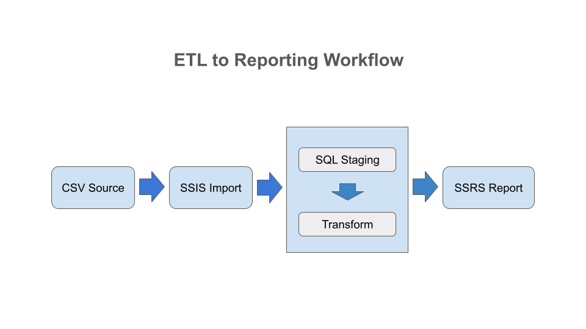

# Simple ETL to Reporting Workflow

## Overview
This project demonstrates an end-to-end data workflow using SSIS, SQL Server, and SSRS. 
It extracts raw CSV data, loads it into SQL Server, transforms it using stored procedures, 
and delivers a clean, validated dataset that the SSRS report uses for visualization.

The SQL scripts used in this project demonstrates standard ETL transformations including deduplication, validation, exception handling, and dimension maintenance. All logic shown is generic and does not represent any proprietary business rules.

## Featured in My YouTube Tutorial
This project is part of a hands-on tutorial published on my YouTube channel, 
Coffee Break In 10, where I demonstrate the full ETL and reporting workflow 
using SSIS, SQL Server, and SSRS. The video walks through the package design, 
stored procedure logic, and the final SSRS report.

Watch the tutorial: YouTube Channel - https://www.youtube.com/@CoffeeBreakIn10
- https://www.youtube.com/watch?v=BvqN8JHOCIE - ETL to Reporting in 10 Minutes: A Complete SSIS‑to‑SSRS Workflow (SSIS ETL Tutorial | SSRS Tutorial) 
- https://www.youtube.com/watch?v=iFqLE_bPtCQ&t=25s - SSIS Data Transformations: 3 Ways to Clean & Load Data (Part 2 — Stored Procedure) 

## Technologies
- SQL Server
- SSIS (ETL)
- SSRS (Reporting)

## Workflow 

- CSV extraction via SSIS
- Data staging in SQL Server
- Data transformations implemented in stored procedure
- SSRS report built on stored procedure output

## Folder Structure
- /src
-	/ssis        --> ETL packages (DTSX)
-	/sql         --> Stored procedures, schema, queries
-	/ssrs        --> Report definition (RDL)
- /data            --> Public or sanitized datasets
- /docs        	 --> diagrams, notes
- /assets      	 --> Screenshots

## Screenshots
Screenshots are available in `/assets`:
- SSIS Control Flow
- SSIS Data Flow
- SSRS Report Design
- SSRS Report Preview

## How to Run
1. Import the SSIS package into Visual Studio.
2. Update connection strings to point to your SQL Server instance.
3. Execute the stored procedures in `/src/sql`.
	-> Create_Table_Script.sql
	-> ssis_Salesorderimport.sql
	-> ssrs_SalesOrderReport.sql
4. Import the SSRS report into Visual Studio.
5. Create shared data source pointing to your SQL Server instance
6. Update the report datasource to use the shared data source as reference

## Sanitization Notice
All connection strings, credentials, and related info have been removed. 
Only public or sample data is included.
This project does not contain any proprietary business logic. All transformations shown are generic ETL patterns.

